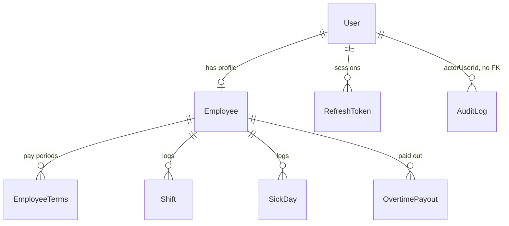

# Work Table

[](https://github.com/SigauriM/work-table/actions/workflows/ci.yml)

Time tracking and payroll calculation for a small team, built around one
constraint: **the numbers have to be right.** Not approximately right — right
across daylight saving transitions, right when a pay rate changed mid-year,
right when a shift crosses midnight into the next month.

React 19 + Express 4 + PostgreSQL 16. TypeScript throughout.

---

## Table of contents

- [Why this project is worth a look](#why-this-project-is-worth-a-look)
- [Features](#features)
- [Domain rules that drove the design](#domain-rules-that-drove-the-design)
- [Architecture](#architecture)
- [Data model](#data-model)
- [API](#api)
- [Quick start](#quick-start)
- [Configuration](#configuration)
- [Local development without Docker](#local-development-without-docker)
- [Testing](#testing)
- [Continuous integration](#continuous-integration)
- [Security model](#security-model)
- [Performance](#performance)
- [Project layout](#project-layout)
- [Known limitations](#known-limitations)
- [License](#license)

---

## Why this project is worth a look

Most timesheet apps handle the happy path. The interesting parts are the four
places where a naive implementation silently produces wrong money:

| Problem | What a naive version does | What this does |
|---|---|---|
| **DST transitions** | Adds 24 h to an instant to get "tomorrow", silently losing or gaining an hour twice a year | Iterates *civil* calendar days in `Europe/Berlin`; rejects the non-existent 02:30 on the spring-forward night; resolves the ambiguous 02:30 in autumn to the first occurrence, deterministically |
| **Money in floats** | `0.1 + 0.2`, and a cent goes missing per row | `decimal.js` and `NUMERIC(10,2)` on the backend; the SPA displays those values as strings, not as JS `number` arithmetic |
| **Rate changes** | Overwrites the rate, so last March silently recalculates at today's rate | Pay terms are temporal periods (`validFrom`/`validTo`); closed periods are immutable; every past day is priced with the rate that applied on that day |
| **Missing data** | Treats a missing rate as `0` and pays someone nothing | Throws — corrupt data must not become a silent zero |

The DST logic is covered by property-based tests (`fast-check`) rather than a
handful of hand-picked dates, and the audit trail is append-only by database
trigger rather than by convention.

If you only read three files, read
[`backend/src/core/berlin.ts`](backend/src/core/berlin.ts),
[`backend/src/core/calculations.ts`](backend/src/core/calculations.ts)
and [`LIMITATIONS.md`](LIMITATIONS.md).

---

## Features

### For employees

- **Month calendar timesheet** — hours worked per day against the daily norm,
  with a running month balance and a lifetime balance.
- **Log a shift** with an optional unpaid break. Overnight shifts are supported.
- **Mark a sick day** — credited at that day's norm, so a weekend sick day
  credits zero.
- **Own data only** — the API scopes every employee request to their own
  records. There is no route that returns someone else's row.
- **Offline-aware PWA** — installable, with an offline banner. API calls are
  never served from the service worker cache.
- **English and German UI**, including server-side error messages.

### For admins

- **Team overview for any month** — hours, balance and monthly pay for every
  active employee, in a fixed number of queries rather than one per person.
- **Employee management** — create, edit, deactivate. Deactivation revokes that
  employee's refresh tokens immediately.
- **Pay terms with history** — move a person between hourly and salary, or
  change a rate, effective from a chosen date, without corrupting past months.
- **Overtime payouts** — record hours paid out; they reduce the lifetime
  balance.
- **Edit any shift, including in a closed month** — employees cannot.
- **Audit log** — who changed what and when, with `before`/`after` snapshots.
- **Forced password change** on first login for accounts an admin created —
  the SPA sends the user to `/change-password`. A still-valid access JWT can
  call other API routes until it expires.

---

## Domain rules that drove the design

These are the decisions that are easy to get wrong and expensive to fix later.

### Everything civil happens in `Europe/Berlin`

The app has one business timezone, `APP_TZ = "Europe/Berlin"`. Conversion
between civil time and instants goes through `Intl` explicitly, never by adding
a fixed offset:

- **Spring forward.** 02:30 on the transition night does not exist.
  `instantFromBerlin` throws rather than silently shifting it to 03:30.
- **Fall back.** 02:30 happens twice. The earlier occurrence is chosen,
  deterministically and on purpose.
- **"The next day"** is `nextBerlinYmd("2026-03-28") === "2026-03-29"`, computed
  on the calendar — not `+86_400_000` on a timestamp, which drifts by an hour
  twice a year and eventually skips or repeats a day.

### A shift belongs to the day it starts

Shifts may cross midnight. All worked minutes are attributed to the shift's
`date`, the starting calendar day. A shift running 22:00 on the 31st to 06:00 on
the 1st counts entirely toward the month of the 31st. That is a deliberate
choice with a documented consequence, not an accident.

### Pay terms are periods, not fields

`EmployeeTerms` rows carry `payType`, `hourlyRate`, `monthlySalary` and
`hoursPerDay` over `[validFrom, validTo)`:

- A closed period (`validTo` set) can never be edited.
- An admin changes conditions by **splitting the open tail** at an
  `effectiveFrom` date: a new period opens, the previous one closes.
- For an hourly employee, a month is priced **day by day** with the rate in
  force on each day, so a mid-month raise lands correctly.
- Changing `hiredAt` after the terms have been split is rejected.

### Months close, and closed months are protected

A calendar month is closed when its last Berlin calendar day is ≤ today, so
the current month is already closed on its last day. Employees get `409` when
they **edit or delete a shift** in a closed month. They can still **create** a
shift, and they can create or delete a sick day, in a closed month. Admins may
still correct shifts; those shift corrections are written to the audit log.
Sick-day writes are not audited.

### Overlaps are business errors, not crashes

A shift that overlaps an existing one returns `409 SHIFT_OVERLAP`. Adjacent
shifts, where `previous.end === next.start`, are allowed. A shift on a day
already marked sick returns `409 SHIFT_SICK_CONFLICT`, and the reverse is
rejected too.

---

## Architecture

```
┌──────────────────────────────────────────────────────────────┐
│  Browser — React 19 SPA (Vite, Tailwind 4, PWA)              │
│  access token in memory only · react-query cache · i18n      │
└───────────────┬──────────────────────────────────────────────┘
                │ same-origin /api  (Vite dev proxy)
┌───────────────▼──────────────────────────────────────────────┐
│  Express 4                                                   │
│  helmet · CORS allowlist · rate limits · CSRF double-submit  │
├──────────────────────────────────────────────────────────────┤
│  routes    →  Zod validation at the boundary                 │
│  services  →  authorization, transactions, audit writes      │
│  core      →  pure domain: Berlin time, Decimal money        │
├──────────────────────────────────────────────────────────────┤
│  Prisma 6                                                    │
└───────────────┬──────────────────────────────────────────────┘
                │
┌───────────────▼──────────────────────────────────────────────┐
│  PostgreSQL 16 — NUMERIC money, append-only audit trigger    │
└──────────────────────────────────────────────────────────────┘
```

**The `core` layer imports neither Prisma nor Express.**
`backend/tests/core.isolation.test.ts` fails CI if anything under `src/core`
imports `@prisma/client`. It does not scan for Express. The payoff: all the
tricky calendar and money logic is testable without a database.

Every module has the same shape:

```
modules/shifts/
├── shifts.routes.ts    HTTP, status codes, nothing else
├── shifts.schema.ts    Zod schemas; types flow from here into the service
└── shifts.service.ts   authorization, transactions, audit
```

---

## Data model



| Table | Purpose | Worth noting |
|---|---|---|
| `User` | Login, password hash, role | `mustChangePassword` drives the forced-reset flow |
| `Employee` | Person, hire date, active flag | `1:1` with `User` |
| `EmployeeTerms` | Pay type, rates, daily norm | Temporal: `validFrom`/`validTo`, closed periods immutable |
| `Shift` | Start, end, optional break | `workedMinutes` denormalised at write time; `date` is the start day |
| `SickDay` | One per employee per day | `UNIQUE(employeeId, date)` |
| `OvertimePayout` | Hours paid out and the amount | Reduces the lifetime balance |
| `RefreshToken` | Opaque session | Only a bcrypt hash of the secret is stored |
| `AuditLog` | `before`/`after` JSON snapshots | Append-only via trigger, indexed for reads |

Money columns are `Decimal(10,2)`. Date-only columns are true `DATE`, not
timestamps. There are 9 ordered migrations, including
`20260827013000_reinterpret_shift_clocks_as_berlin`, which re-interpreted
already-stored shift clocks after the timezone handling was corrected — the
data migration mattered as much as the code fix.

---

## API

Base path `/api/v1`; `/health` is unversioned. JSON endpoints return JSON;
successful deletes return `204` with no body. Errors carry both a human-readable
`error` and a stable machine `code`:

```json
{ "error": "Overlapping shift", "code": "SHIFT_OVERLAP" }
```

The frontend translates on `code`, so adding a language never means matching on
English error strings.

### Auth

| Method | Path | Notes |
|---|---|---|
| `POST` | `/auth/login` | Rate-limited per IP + login. Access token in the body, refresh in an httpOnly cookie |
| `POST` | `/auth/refresh` | CSRF header required; rate-limited per token |
| `POST` | `/auth/logout` | CSRF header required; revokes the refresh token |
| `GET` | `/auth/me` | Current user and role |
| `PATCH` | `/auth/password` | Revokes all other sessions |

### Shifts, sick days, payouts

| Method | Path | Who |
|---|---|---|
| `GET` | `/shifts` | Employee: own only. Admin: `employeeId` required. Cursor-paginated when not filtered by month |
| `POST` | `/shifts` | Both; closed months are not checked |
| `PATCH` `DELETE` | `/shifts/:id` | Both, scoped; closed months rejected for employees |
| `GET` `POST` | `/sick-days` | Both, scoped; closed months are not checked |
| `DELETE` | `/sick-days/:id` | Both, scoped; closed months are not checked |
| `GET` `POST` | `/employees/:id/overtime-payouts` | Admin |
| `DELETE` | `/employees/:id/overtime-payouts/:payoutId` | Admin |

### Employees, stats, audit

| Method | Path | Who |
|---|---|---|
| `GET` `POST` | `/employees` | Admin |
| `GET` `PATCH` `DELETE` | `/employees/:id` | Admin |
| `GET` | `/stats/overview?year&month` | Admin — the whole team for a month |
| `GET` | `/employees/:id/stats?year&month` | Admin — one employee for a month |
| `GET` | `/me/stats?year&month` | Employee — own month plus lifetime balance |
| `GET` | `/audit?entity&entityId&cursor&take` | Admin — cursor-paginated, `take` ≤ 100 |

---

## Quick start

Requires Docker and Docker Compose. Nothing else.

```bash
git clone https://github.com/SigauriM/work-table.git
cd work-table
cp .env.example .env      # PowerShell: Copy-Item .env.example .env
```

Set three values in `.env`:

```dotenv
ADMIN_LOGIN=admin
ADMIN_PASSWORD=choose-a-strong-one
JWT_ACCESS_SECRET=any-long-random-string
```

Then:

```bash
docker compose up
```

Compose waits for Postgres to become healthy, applies the migrations, seeds the
admin account and starts both services. Open **http://localhost:5173** and log
in with the credentials above.

To try it from a phone on the same network, browse to
`http://<your-lan-ip>:5173` and keep `COOKIE_SECURE=false` — browsers refuse to
store `Secure` cookies over plain HTTP.

---

## Configuration

| Variable | Default | Purpose |
|---|---|---|
| `PORT` | `3000` | Backend port |
| `DATABASE_URL` | compose `db` | Postgres connection string |
| `POSTGRES_USER` / `_PASSWORD` / `_DB` / `_PORT` | `worktable` | Database container |
| `ADMIN_LOGIN` / `ADMIN_PASSWORD` | — | **Required to seed** the admin account, not to boot Express |
| `JWT_ACCESS_SECRET` | — | **Required.** Signs access tokens |
| `JWT_ACCESS_EXPIRES` | `15m` | Access token lifetime |
| `JWT_REFRESH_DAYS` | `7` | Refresh token lifetime |
| `COOKIE_SECURE` | `false` | Set `true` behind HTTPS |
| `CORS_ORIGINS` | `http://localhost:5173, http://127.0.0.1:5173` | Comma-separated allowlist. `*` is dropped; an empty list after that falls back to the default — credentialed CORS cannot use `*` |

Refresh tokens are **not** JWTs, so there is no refresh secret to configure:
they are opaque `id.secret` pairs, stored as a bcrypt hash of the secret.

---

## Local development without Docker

Postgres 16 must be reachable and `DATABASE_URL` must point at it.

```bash
# backend
cd backend
npm ci
npx prisma migrate deploy
npx prisma db seed
npm run dev            # tsx watch, http://localhost:3000

# frontend, in a second shell
cd frontend
npm ci
npm run dev            # Vite, http://localhost:5173, proxies /api
```

---

## Testing

146 tests across four suites, each with a different job:

| Suite | Count | Command | Covers |
|---|---:|---|---|
| Backend unit | 99 | `cd backend && npm test` | Pure domain: Berlin time, balances, pay, CORS parsing, error codes |
| Backend integration | 23 | `cd backend && npm run test:int` | Real Postgres: authorization, overlaps, closed months, terms splitting, audit writes |
| Frontend unit | 18 | `cd frontend && npm test` | API client including refresh de-duplication, auth context, timesheet, error translation, `axe` accessibility |
| End-to-end | 6 | `cd frontend && npm run test:e2e` | Playwright against a seeded backend: log in, log a shift, watch the balance move |

Worth calling out:

- **Property-based DST tests.** `berlin.fastcheck.test.ts` generates dates
  rather than listing them, so the transition nights are covered by
  construction instead of by memory.
- **An architecture test.** `core.isolation.test.ts` fails if anything under
  `src/core` imports `@prisma/client`.
- **Coverage thresholds are enforced in CI**, not merely reported: 80% lines,
  functions, branches and statements on `src/core/**` (unit) and on
  `src/modules/**/*.service.ts` (integration).

```bash
cd backend && npm run test:coverage      # unit + coverage
cd backend && npm run test:int:coverage  # integration + coverage (needs Postgres)
```

---

## Continuous integration

Four independent jobs on every push and pull request to `main`:

| Job | Steps |
|---|---|
| `frontend` | `tsc -b` · `eslint --max-warnings 0` · unit tests · production build · **`size-limit` bundle budget** |
| `backend` | `audit-ci` dependency scan · typecheck · unit tests with coverage |
| `backend-int` | Postgres 16 service container · `prisma migrate deploy` · integration tests with coverage |
| `e2e` | Postgres · migrate · seed · boot the API · health-poll · Playwright on Chromium |

The bundle budget is deliberate: a size regression should break the build, not
be discovered in production.

---

## Security model

**Tokens.** The access token is a 15-minute JWT held **in memory only** — never
in `localStorage`, so XSS cannot read it. The refresh token is opaque
(`id.secret`), delivered as an httpOnly cookie scoped to `Path=/api/v1/auth`
with `SameSite=Strict`, and stored server-side only as a bcrypt hash of the
secret. It is revoked on logout, password change, deactivation, or after 7 days.

**CSRF.** Double-submit cookie on the two endpoints that authenticate from a
cookie alone: `POST /auth/refresh` and `POST /auth/logout`.

**Brute force.** Login is limited per IP + login pair, and successful attempts
are not counted against the limit. Refresh is limited per token id, with a
separate limit for junk tokens per IP.

**Timing.** A login for an unknown user still runs a bcrypt comparison against a
dummy hash, so response time does not reveal whether an account exists. Refresh
does the same.

**Audit.** `AuditLog` is append-only, enforced by a `BEFORE UPDATE OR DELETE`
trigger that raises even for the application's own database role.

**Transport.** `helmet` is enabled everywhere except the test environment, so
security headers cannot go missing because an environment variable was
forgotten. CORS is an explicit allowlist and rejects `*`.

**Writes.** Shifts and terms happen inside transactions, with the conflict
checks and the audit record in the same transaction as the change. Sick-day
creates run in a transaction with the shift-conflict check; they do not write
`AuditLog`.

---

## Performance

`GET /stats/overview` is the heaviest endpoint: it prices a whole team for a
month. It loads employees with their terms, shifts, sick days and payouts in a
fixed handful of queries and computes in memory — it does **not** call the
per-employee statistics path in a loop.

Measured 2026-08-27 against Postgres 16 on localhost, with 200 active hourly
employees hired 2026-01-15 and one shift each, 20 samples after 2 warm-ups:

| p95 | min | max | Budget |
|---:|---:|---:|---:|
| ≈ 33 ms | ≈ 29 ms | ≈ 35 ms | < 200 ms |

Comfortably inside budget, so no cache and no `MonthlyStats` table were added.
Caching here would have been complexity paid for nothing measurable.

---

## Project layout

```
backend/
├── prisma/
│   ├── schema.prisma
│   ├── migrations/        9 ordered migrations
│   └── seed.ts            refuses to run in production
├── src/
│   ├── core/              pure domain — no Prisma, no Express
│   ├── config/            env parsing, CORS allowlist, Prisma client
│   ├── middleware/        auth, admin guard, employee scoping, errors
│   └── modules/           auth · employees · terms · shifts · sick-days ·
│                          payouts · stats · audit
└── tests/
    └── integration/       real Postgres

frontend/
├── src/
│   ├── api/               typed client, in-memory token, refresh de-dup
│   ├── components/        AppShell, ErrorBoundary, OfflineBanner, focus trap
│   ├── i18n/              en + de, including API error codes
│   ├── hooks/
│   └── pages/             admin/ · employee/
└── e2e/                   Playwright
```

---

## Known limitations

Every non-trivial project has edges the author chose not to smooth. They are
documented — with the reasoning and with the conditions under which they should
be revisited — in **[`LIMITATIONS.md`](LIMITATIONS.md)**, including why refresh
token rotation is currently off, why the overview endpoint has no cache, and how
overnight shifts interact with month boundaries.

Not in v1, deliberately:

- **Public holidays.** The daily norm is Mon–Fri; German state holidays are not
  modelled. The hook for adding them is `hoursPerDayForYmd` in
  `core/calculations.ts`.
- **Vacation tracking.**
- **Salary proration** for a partial first month.
- **Overlap enforcement in the database.** Overlaps are rejected by the
  application inside a transaction; a `tstzrange` exclusion constraint would
  close the remaining race window under concurrent writes.

---

## License

MIT.
